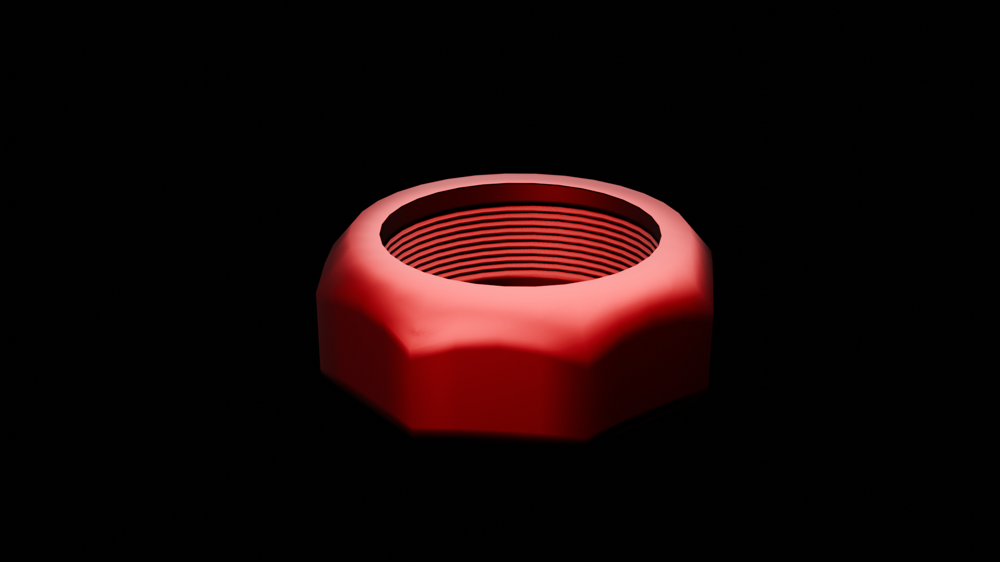
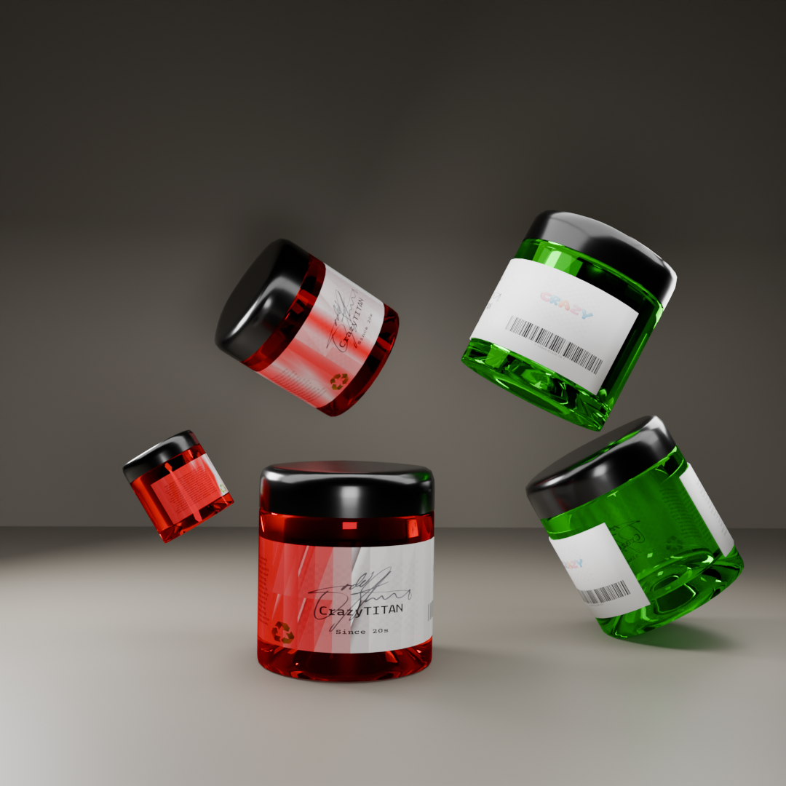
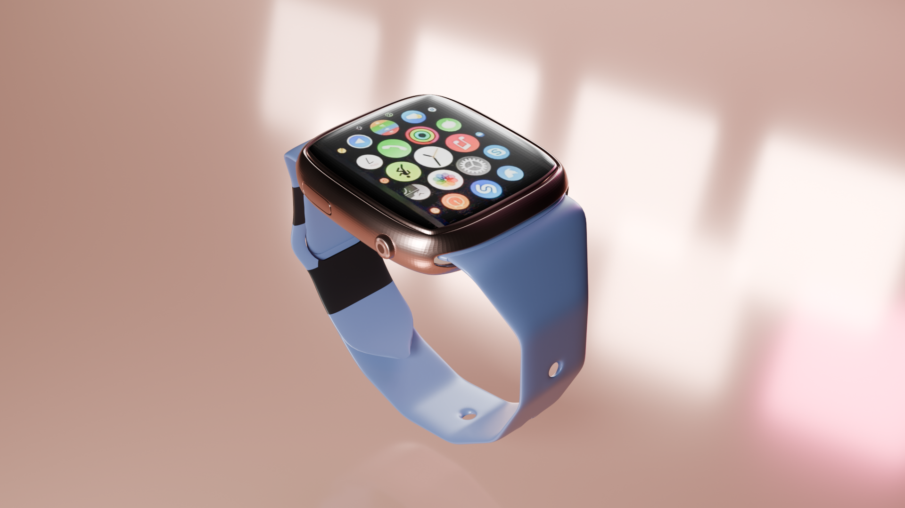

## 3D Modeling Portfolio (Blender)

A collection of 3D models created using **Blender**, focusing on product visualization, mechanical components, and multi-object advertisement scenes.

---

### Perfume Bottle

- Product visualization with realistic materials and lighting  
- Rendered using Blender (Cycles / Eevee)  
- 📈 Achieved **35+ downloads** on CGTrader  
🔗 [View on CGTrader](https://www.cgtrader.com/free-3d-models/scanned/various/perfumes-for-electrical-students)

---

### Donut (Blender Practice)

- Procedural shading and texture work  
- Lighting and camera composition  
[Watch Render Video](Donut/donut-2.mp4)

---

### 🧊 Cube (Modeling & Materials Study)

- Fundamental modeling and material experimentation    
[Watch Render Video](Cube/cycle.mp4)

---

### Nut & Bolt

- Precision mechanical modeling  
- Clean topology and accurate proportions  

---

### Ads – Multi Object Scene

- Multi-object composition for advertisement-style rendering  
- Scene setup, lighting, and camera composition  

---

### Wrist Watch

- Detailed product modeling with metallic and glass materials  
- Focus on realism, reflections, and material accuracy  
